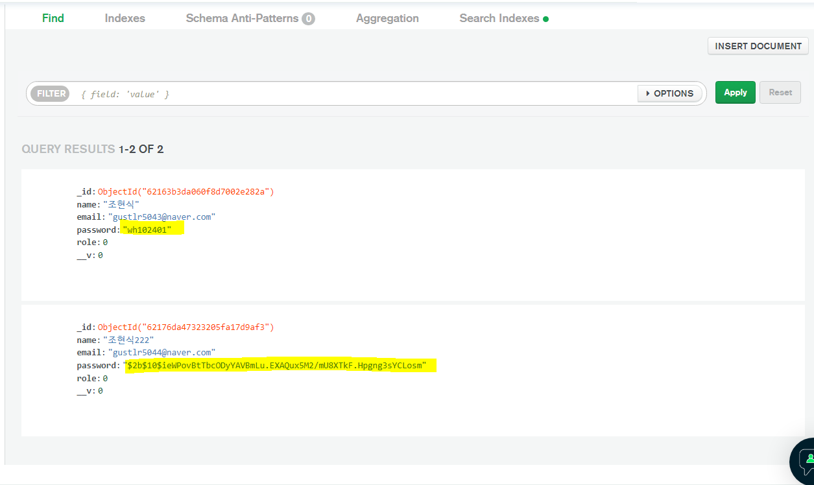

## Node JS란 ?

javascript를 브라우저가 아닌 서버사이드에서도 쓸수있게 만들어주는 친구!

1. 노드가 다운되어있는지 확인
   - 터미널에서 node -v로 버전 나오는지 체크
2. 다운되어 있지 않다면
   - 구글에서 nodejs 검색 및 다운로드(최신보단 안정버전으로 받자)
3. 폴더하나 생성해주고
4. 그 안에서 npm init 명령어로 package.json 생성해주기
   - 다 엔터 치면됨
5. index.js 생성해주기
   - 서버가 이 파일부터 시작함


## Express JS란 ?

Node JS를 이용해서 서버를 개발하고자 할때 보다 쉽게 서버를 구성할 수 있게 만든 프레임워크

1. 비주얼스튜디오에서 npm install express --save

   - package.json에 아래와 같이 추가됨을 확인

     ```json
       "dependencies": {
         "express": "^4.17.3"
       }
     ```

2. express.js 홈페이지 가서 기본 스타팅 코드 index.js에 넣어주기

   ```javascript
   const express = require('express');
   const app = express();
   const port = 3000;
   
   app.get('/', (req, res) => {
     res.send('Hello World!');
   });
   
   app.listen(port, () => {
     console.log(`Example app listening on port ${port}`);
   });
   ```

3. pacakage.js에 start파일 설정해주기

   ```json
     "scripts": {
       "start": "node index.js",    // 추가해준다.
       "test": "echo \"Error: no test specified\" && exit 1"
     },
   ```

4. npm run start로 확인해주기

   - run 뒤에 start가 scripts안에 start를 실행해준다는 것을 의미 (만약 server로 scripts에 추가를 했다면 npm run server해준다.)

5. 브라우저에 http://localhost:5000/ 치고 들어가면 hello world 보임


## MongoDB란 ?

무료 클라우딩 DB 서버

구글에 MongoDB치고 가입 후 진행


## Mongoose란 ?

몽고DB를 편하게 쓸수 있는 Object Modeling Tool

- npm install mongoose --save

  Pacakge.jons에 추가됨 확인

  ```json
    "dependencies": {
      "express": "^4.17.3",
      "mongoose": "^6.2.2"
    }
  ```

- 작업 후 npm run server로 연결했는데  아래와 같은 에러가 뜬다면 ?

  ```
  MongooseServerSelectionError: Could not connect to any servers in your MongoDB Atlas cluster. One common reason is that you're trying to access the database from an 
  IP that isn't whitelisted. Make sure your current IP address is on your Atlas cluster's IP whitelist: https://docs.atlas.mongodb.com/security-whitelist/
  ```

  1. mongoDB 페이지 좌측 Tab에 Network Access클릭
  2. ADD IP ADDRESS 클릭
  3. ADD CURRENT IP ADDRESS 클릭
  4. Confirm
  5. PENDING 어쩌구 하는거 작업 완료되면 재시도 ㅇㅇ!

## body-parser란 ?

client에서 보낸 data를 server에서 사용할수 있도록 parser?(정제?)해주는 친구

- npm install body-parser --save


## nodemon이란 ?

소스를 변경할때 그걸 감지해서 자동으로 서버를 재시작해주는 tool

- npm install nodemon --save-dev

- 시작할때 노드몬으로 시작하기 위해서 script 추가

  ```json
    "scripts": {
      "server": "node index.js",
      "test": "echo \"Error: no test specified\" && exit 1",
      "backend": "nodemon index.js"
    },
  ```

  - 이제 npm run backend로 서버 키면 됨


## Bycrypt로 비밀번호 암호화하기

- npm install bcrypt --save
- 

